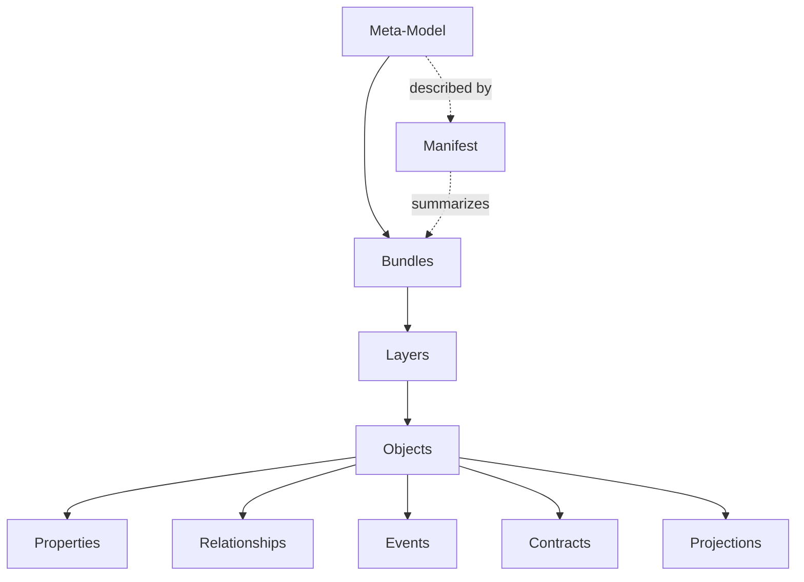

# MMAS-Core

**Meta-Universe Specification**

**Document ID:** MU-V2-ARCH-001  
**Title:** Meta-Model Architecture Standard — Core Architecture  
**Document Class:** Normative  
**Version:** 2.0 (Draft)  
**Status:** Working Draft  
**Normative References:** Meta-Universe Constitution (MUC), Versioning, Naming-Conventions, Validation, MMAS-Package, MMAS-Conformance  
**Informative References:** Meta-Universe Federation Protocol (MUFP)  
**Copyright:** © Orkestron.AI  
**License:** Apache-2.0

---

# 1. Purpose

This document defines the fundamental architectural building blocks that every Meta-Model SHALL follow within the Meta-Universe ecosystem.

MMAS-Core establishes a common semantic architecture that enables independent Meta-Models to remain interoperable while evolving autonomously.

MMAS-Core is not merely a catalogue of building blocks. It defines a single architectural **composition model**: a canonical hierarchy that determines how every semantic primitive nests within the next, from the Meta-Model as a whole down to individual Properties, Relationships, Events, Contracts and Projections, and back up to the Manifest that describes the composition. In the same way that UML defines the core modelling building blocks from which every model is constructed, MMAS-Core defines the core compositional building blocks from which every Meta-Model in the Meta-Universe is constructed. Versioning, Validation, Packaging and Conformance all reference this single model rather than re-deriving their own.

MMAS-Core extends the Meta-Universe Constitution (MUC).

---

# 2. Scope

This specification applies to every Meta-Model claiming MMAS conformance, regardless of domain, implementation technology or storage mechanism.

---

# 3. Architectural Principles

Every Meta-Model SHALL:

- conform to the Meta-Universe Constitution;
- describe semantics rather than implementation;
- preserve stable identities;
- separate schema from instance data;
- support federation;
- support evolution;
- remain machine-readable and human-readable.

---

# 4. Composition Hierarchy

MMAS-Core defines a single, canonical composition hierarchy. Every Meta-Model SHALL be expressible as a strict nesting of the concepts below, and every conforming tool, validator and federation agent SHALL interpret the hierarchy identically.

The hierarchy reads top-down as containment and bottom-up as description:

- a **Meta-Model** contains one or more **Bundles**;
- a **Bundle** contains one or more **Layers**;
- a **Layer** contains one or more **Objects**;
- an **Object** is described by **Properties** and connected, qualified, evolved and governed by **Relationships**, **Events**, **Contracts** and **Projections**;
- the entire composition is summarized and made discoverable by a **Manifest**.

## 4.0.1 Hierarchy Diagram (Mermaid)



## 4.0.2 Hierarchy Diagram (ASCII)

```text
Meta-Model
│
├── Manifest .............. (describes & summarizes the whole composition)
│
└── Bundles
    └── Layers
        └── Objects
            ├── Properties ...... what the object is
            ├── Relationships ... how it connects to other objects
            ├── Events .......... how it changes over time
            ├── Contracts ....... under which rules it may be used
            └── Projections ..... how it appears in a given context
```

This hierarchy is the centerpiece of MMAS. It is the structure that [Versioning](Versioning.md) versions, that [Validation](Validation.md) validates level by level, that [MMAS-Package](MMAS-Package.md) packages, and that [MMAS-Conformance](MMAS-Conformance.md) measures for maturity. A Meta-Model that cannot be expressed as this hierarchy is not MMAS-conforming.

---

# 5. Core Building Blocks

Every Meta-Model SHALL be composed from the following architectural concepts, which are the named levels of the Composition Hierarchy defined in Section 4.

## 5.1 Meta-Model

A Meta-Model defines the semantic structure of a domain.

A Meta-Model SHALL have:

- unique identifier;
- namespace;
- version;
- owner;
- manifest;
- compatibility declaration.

---

## 5.2 Bundle

A Bundle groups semantically related concepts.

Bundles SHALL:

- have a single responsibility;
- minimize dependencies;
- publish exported concepts.

Examples:

- Identity
- Knowledge
- Governance
- Runtime

---

## 5.3 Layer

A Layer represents one coherent semantic concern within a Bundle.

Layers SHALL:

- remain independently understandable;
- avoid overlapping responsibilities;
- expose stable identifiers.

---

## 5.4 Object

Objects represent semantic entities.

Objects SHALL possess:

- identity;
- lifecycle;
- ownership;
- provenance;
- traceability.

---

## 5.5 Property

Properties describe objects.

Every property SHOULD declare:

- type;
- cardinality;
- optionality;
- origin;
- confidence (when applicable).

---

## 5.6 Relationship

Relationships connect objects.

Relationships SHALL explicitly define:

- source;
- target;
- semantic meaning;
- cardinality.

---

## 5.7 Event

Events describe meaningful changes.

Events SHOULD be immutable and traceable. The Event primitive is defined in detail in [Event](../04-core-concepts/Event.md).

---

## 5.8 Projection

A Projection is a context-specific representation of an object.

A projection SHALL NOT redefine object identity.

---

## 5.9 Contract

Contracts define semantic agreements governing interaction, disclosure or federation.

---

## 5.10 Context

Context determines how semantics are interpreted.

Context SHALL be explicit whenever meaning depends upon it.

---

# 6. Public Schema

Every Meta-Model SHALL expose a public schema.

The schema SHALL describe structure without requiring disclosure of instance data.

Schema discovery SHALL be possible independently from data access.

---

# 7. Separation of Schema and Instance

MMAS distinguishes:

- Meta-Model (schema)
- Instance (facts)

Knowledge exchange SHALL begin with schema discovery before instance disclosure.

---

# 8. External Semantic Models

A Meta-Model MAY import external standards.

Imported concepts SHALL preserve references to:

- originating standard;
- version;
- namespace.

Local extensions SHALL NOT modify the imported semantics.

Instead, they SHALL extend them.

---

# 9. Extensibility

Meta-Models SHALL evolve through extension rather than modification whenever practical.

Extensions SHALL:

- declare ownership;
- declare compatibility;
- preserve existing semantics.

---

# 10. Technology Independence

MMAS defines architecture, not storage.

Conforming implementations MAY use:

- Git repositories;
- Graph databases;
- Relational databases;
- Document stores;
- APIs;
- Knowledge graphs;
- Event streams.

No implementation technology is normative.

---

# 11. Architectural Invariants

Every MMAS-conforming Meta-Model SHALL preserve:

- identity;
- semantic consistency;
- traceability;
- ownership;
- context;
- versioning;
- federation readiness.

---

# 12. Relationship to Other Standards

MMAS-Core builds upon MUC and supplies the composition model that the remaining MMAS documents specialize:

- [Versioning](Versioning.md) versions the hierarchy and its elements;
- [Naming Conventions](Naming-Conventions.md) names the hierarchy and its elements;
- [Validation](Validation.md) validates the hierarchy across levels V0–V5;
- [MMAS-Package](MMAS-Package.md) packages the hierarchy for distribution;
- [MMAS-Conformance](MMAS-Conformance.md) measures architectural maturity over the hierarchy.

MUFP defines federation behavior.

---

# 13. Future Directions

The Composition Hierarchy is intentionally finite and stable, but its role as the shared reference model invites a dedicated, machine-actionable expression. A future **Meta-Universe Diagram Language (MUDL)** would standardize the visual and textual notation for the hierarchy and its instances, so that the Mermaid and ASCII renderings in this document become two profiles of one normative diagramming standard rather than illustrative examples. MUDL would cover element shapes, containment semantics, projection overlays and federation views, allowing tools to render any Meta-Model deterministically and round-trip diagrams back into MMAS structures.

---

# Final Statement

MMAS-Core defines the common architectural language from which every Meta-Model in the Meta-Universe ecosystem is constructed.

Domain-specific semantics are intentionally left to individual Meta-Models.
