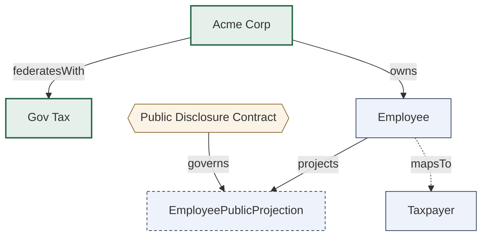

# Meta-Universe Diagram Language (MUDL)

**Meta-Universe Specification**

**Document ID:** MU-V2-REFARCH-010  
**Title:** Meta-Universe Diagram Language (MUDL)  
**Document Class:** Informative  
**Version:** 2.0 (Draft)  
**Status:** Working Draft  
**Normative References:** None  
**Informative References:** [Reference-Diagrams](Reference-Diagrams.md), [MMAS-Interchange](../02-architecture/MMAS-Interchange.md), [Projection](../04-core-concepts/Projection.md), [Semantic-Mapping](../03-federation/Semantic-Mapping.md)  
**Copyright:** © Orkestron.AI  
**License:** Apache-2.0

---

# 1. Purpose

The canonical diagrams in [Reference-Diagrams](Reference-Diagrams.md) standardize the
*meaning* of Meta-Universe pictures, but not their *machine-readable form*: today a
diagram's intent is canonical while its rendering is hand-drawn. The **Meta-Universe
Diagram Language (MUDL)** closes that gap by defining a structured, machine-readable
representation of a diagram, so that a diagram becomes **another Projection of the
model** rather than a separately maintained artifact.

MUDL is to the Meta-Universe what BPMN is to processes, UML to software, or ArchiMate to
enterprise architecture — a dedicated visual language — except that its source of truth is
the semantic meta-model itself.

---

# 2. Scope

This document defines:

- the **node types** a MUDL diagram may contain;
- the **edge types** that connect them;
- a **YAML serialization** for authoring, versioning and diffing diagrams as data;
- **generation targets** — Mermaid, PlantUML and SVG — produced deterministically from
  the same source;
- one worked example.

It is Informative: it explains and demonstrates a representation rather than imposing new
normative obligations on conforming implementations.

---

# 3. A Diagram Is Another Projection

A [Projection](../04-core-concepts/Projection.md) is how a Meta-Object appears in a given
context. A MUDL diagram is exactly that: a projection of part of a meta-model into a
*visual* context. Because a MUDL document is generated from — and validated against — the
underlying [MUIF](../02-architecture/MMAS-Interchange.md) model, the diagram cannot drift
from the semantics it depicts. Authored as data, validated for conformance, rendered
deterministically: the picture is a derived view, not a parallel source of truth.

---

# 4. Node Types

A MUDL node represents a semantic element. The defined node types are:

| Node type | Represents | Canonical shape |
|-----------|------------|-----------------|
| `Universe` | A semantic authority / sovereignty boundary | Double-bordered rectangle |
| `Namespace` | A published organization of concepts | Folder / tabbed rectangle |
| `Object` | A Semantic Point of Truth (*what exists*) | Rectangle |
| `Projection` | How an Object appears in a context | Rectangle (dashed border) |
| `Contract` | The rules under which knowledge may be used | Hexagon |
| `Event` | What happened / change over time | Rounded rectangle |

Shapes follow the Diagram Conventions in [Reference-Diagrams](Reference-Diagrams.md)
Section 13.

---

# 5. Edge Types

A MUDL edge represents a semantic connection. The defined edge types are:

| Edge type | Meaning | Typical endpoints |
|-----------|---------|-------------------|
| `owns` | semantic ownership / authority | Universe → Namespace, Universe → Object |
| `projects` | an Object appears as a Projection | Object → Projection |
| `binds` | a canonical identity bound to a local one | Object → Object (cross-universe) |
| `governs` | a Contract governs an Object or Projection | Contract → Object, Contract → Projection |
| `mapsTo` | a Semantic Mapping correspondence | Object → Object |
| `synchronizes` | state kept consistent across universes | Object → Object |
| `federatesWith` | a federation relationship between Universes | Universe → Universe |

Edge styles follow the conventions: solid arrows for semantic relationships, dashed
arrows for references.

---

# 6. YAML Serialization

A MUDL document is a YAML (or equivalently JSON) object with a `mudl` version tag, a
`nodes` list and an `edges` list. Each node declares an `id`, a `type` (Section 4) and a
human `label`; each edge declares `from`, `to` and a `type` (Section 5). Identifiers and
labels are non-semantic display aids; the binding `id` values are what generators and
validators key on.

```text
mudl: <version>
nodes:
  - id:    <local identifier>
    type:  Universe | Namespace | Object | Projection | Contract | Event
    label: <display name>
edges:
  - from:  <node id>
    to:    <node id>
    type:  owns | projects | binds | governs | mapsTo | synchronizes | federatesWith
```

A MUDL document SHOULD be derivable from the MUIF model it depicts, so that the diagram is
a generated Projection rather than a hand-authored duplicate.

---

# 7. Generation Targets

A conformant generator renders a single MUDL source deterministically to:

- **Mermaid** — for inline rendering in Markdown and on code-hosting platforms (the form
  used by the [`assets/`](../assets/) diagram set);
- **PlantUML** — for toolchains that already standardize on it;
- **SVG** — for fixed, publication-grade artwork.

The same source SHALL produce the same picture across all targets; only the concrete
syntax differs. The node and edge types map onto each target's shapes and connectors per
the canonical visual notation.

---

# 8. Worked Example

A small MUDL document: the Acme universe owns an `Employee` Object, which is governed by a
public Contract and projects to a public Projection; Acme federates with the Gov universe,
and the two Person objects are mapped.

## 8.1 MUDL source (YAML)

```yaml
mudl: 1.0
nodes:
  - id: u_acme
    type: Universe
    label: "Acme Corp"
  - id: u_gov
    type: Universe
    label: "Gov Tax"
  - id: emp_employee
    type: Object
    label: "Employee"
  - id: emp_public
    type: Projection
    label: "EmployeePublicProjection"
  - id: c_public
    type: Contract
    label: "Public Disclosure Contract"
  - id: gov_taxpayer
    type: Object
    label: "Taxpayer"
edges:
  - from: u_acme
    to: emp_employee
    type: owns
  - from: emp_employee
    to: emp_public
    type: projects
  - from: c_public
    to: emp_public
    type: governs
  - from: u_acme
    to: u_gov
    type: federatesWith
  - from: emp_employee
    to: gov_taxpayer
    type: mapsTo
```

## 8.2 Generated Mermaid



Because the Mermaid was generated from the MUDL source, and the MUDL source is itself a
Projection of the meta-model, the picture is guaranteed to agree with the model it
illustrates.

---

# 9. Future Directions

**MUDL** is expected to mature into a standalone informative specification covering the
full node and edge vocabulary, the canonical visual notation (shapes, borders, arrow
styles), the YAML/JSON schema, and conformant generators to Mermaid, PlantUML and SVG. Its
defining property is that a diagram becomes another Projection of the meta-model —
authored as data, validated for conformance and rendered deterministically — so that
visual documentation across thousands of repositories stays consistent and always in step
with the models it illustrates. A further direction is a **diagram diff** capability that
reports semantic, not pixel, changes between two MUDL revisions.

---

# Final Statement

MUDL makes a Meta-Universe diagram what every other artifact in the specification already
is: a Projection of the model, derived from a single source of truth. A picture authored
as data cannot quietly contradict the semantics it depicts — it can only render them.
