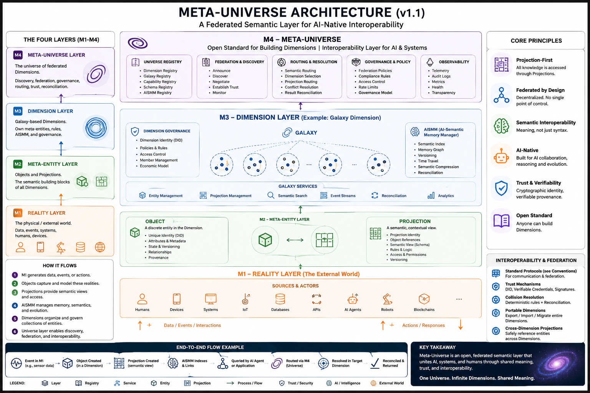

# Meta‑Universe

> A federated semantic interoperability standard for interaction between reality, semantic identities, contextual representations, AI agents, and distributed governance ecosystems.

---

# Why Meta‑Universe Exists

Modern digital ecosystems are fragmented.

Today:
- products live in Jira,
- infrastructure lives in Kubernetes,
- code lives in Git,
- runtime knowledge lives in monitoring systems,
- business knowledge lives in documents,
- AI agents work with partial context,
- organizations duplicate semantic descriptions everywhere.

As systems grow:
- semantic inconsistency increases,
- AI hallucinations increase,
- synchronization between systems becomes harder,
- ownership of knowledge becomes unclear,
- automation becomes dangerous.

Meta‑Universe is an attempt to solve this problem.

Not by creating:
- another database,
- another knowledge graph,
- another monolithic platform.

But by creating:
# a federated semantic infrastructure.

---

# Simple Analogy

Imagine the Internet.

The Internet does not:
- own all websites,
- store all information centrally,
- force everyone to use the same technology.

Instead, the Internet provides:
- conventions,
- protocols,
- routing,
- interoperability.

Meta‑Universe applies the same idea to:
- semantic systems,
- AI ecosystems,
- software products,
- organizations,
- infrastructure,
- and digital reality itself.

---

# Core Idea

Meta‑Universe separates:

| Layer | Meaning |
|---|---|
| Reality | What actually exists |
| Identity | Canonical semantic identity |
| Representation | Contextual semantic views |
| Federation | Interoperability between ecosystems |

---

## Meta‑Universe Architecture

<p align="center">
  
</p>

<p align="center">
  <em>Meta‑Universe Architecture v1.1</em>
</p>

---

# Layered Reality Model

## M1 — Reality Layer

The real world.

Examples:
- companies,
- APIs,
- deployed software,
- runtime infrastructure,
- legal contracts,
- humans,
- AI deployments.

---

## M2 — Meta‑Object Layer

Canonical semantic identities.

Meta‑Object is:
# the canonical semantic anchor.

---

## M3 — Meta‑Model Layer

Semantic representations and contextual structures.

Examples:
- AISMM,
- architecture models,
- projections,
- contracts,
- simulations.

---

## M4 — Federation & Interoperability Layer

The semantic protocol layer.

M4 defines:
- interoperability,
- federation,
- trust,
- synchronization,
- semantic routing,
- collision resolution.

---

# Meta‑Universe Hierarchy

```text
Universe
 └── Dimension
      └── Galaxy
           └── Object
                └── Projection
```

---

# Universe

Universe is:
# an interoperability space.

Universe defines:
- conventions,
- federation rules,
- trust mechanisms,
- synchronization semantics,
- semantic routing,
- collision resolution.

---

# Dimension

Dimension is:
# an independent semantic governance authority.

A Dimension controls:
- object registration,
- ownership verification,
- semantic schemas,
- AI permissions,
- federation policies.

---

# Galaxy

Galaxy is:
# a bounded semantic ecosystem.

Galaxies contain:
- Objects,
- Projections,
- AI agents,
- synchronization systems.

---

# Object

Object is:
# the canonical semantic identity of a real-world entity.

Object exists to provide:
- semantic identity,
- ownership,
- synchronization authority,
- federation identity.

---

# Projection

Projection is:
# a contextual semantic representation of an Object.

Projection exists for:
- interaction,
- synchronization,
- federation,
- AI reasoning,
- orchestration.

---

# Projection‑First Architecture

Most systems only need:
- usable semantic representation,
- synchronization guarantees,
- contextual semantic view.

Projection-first architecture enables:
- scalability,
- federation,
- partial consistency,
- AI optimization,
- security isolation.

---

# AISMM in Meta‑Universe

AISMM is considered:
# a hybrid generative/reflective Meta‑Model.

AISMM may:
- describe existing systems,
- generate future systems,
- orchestrate AI workflows,
- synchronize runtime state.

---

# Federation Philosophy

Meta‑Universe federation is based on:
- autonomy,
- interoperability,
- contextual trust,
- projection exchange,
- semantic synchronization.

---

# Trust Model

Trust is federated.

Trust MAY include:
- ownership trust,
- synchronization trust,
- federation trust,
- AI trust,
- verification trust.

---

# AI in Meta‑Universe

AI agents are:
# semantic controllers.

AI systems MAY:
- analyze semantic structures,
- reconcile drift,
- synchronize ecosystems,
- generate semantic changes,
- orchestrate workflows.

---

# Reconciliation Loop

```text
observe reality
→ compare semantic state
→ detect drift
→ generate semantic changes
→ validate
→ synchronize
```

---

# Repository Structure

```text
/tmpl
/tmpl/Diva-Dimension.md
/tmpl/Diva-Meta-Entities.md

Meta-Universe.md
Dimension-Galaxy.md
Meta-Entities.md
Object.md
Projection.md
```

---

# Current Status

Meta‑Universe is currently:
- conceptual,
- experimental,
- evolving.

---

# Related Concepts

Meta‑Universe intersects with:
- Digital Twins,
- Semantic Web,
- Kubernetes reconciliation model,
- GitOps,
- Distributed Identity,
- IoT ecosystems,
- Multi-agent systems,
- Knowledge graphs,
- AI orchestration systems.
