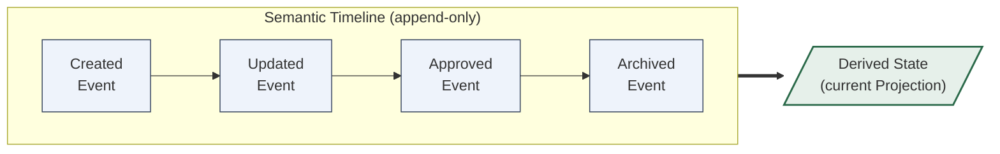

# Event Flow

```mermaid
flowchart LR
    subgraph TL["Semantic Timeline (append-only)"]
        direction LR
        E1["Created<br/>Event"] --> E2["Updated<br/>Event"]
        E2 --> E3["Approved<br/>Event"]
        E3 --> E4["Archived<br/>Event"]
    end

    TL ==> STATE[/"Derived State<br/>(current Projection)"/]

    classDef event fill:#eef3fb,stroke:#33415c,stroke-width:1px;
    classDef state fill:#e6f0ea,stroke:#2b6a4a,stroke-width:2px;
    class E1,E2,E3,E4 event;
    class STATE state;
```

*Caption: Events accumulate immutably on the Semantic Timeline; current state is derived by replaying them, so every state is explainable through its Events.*
