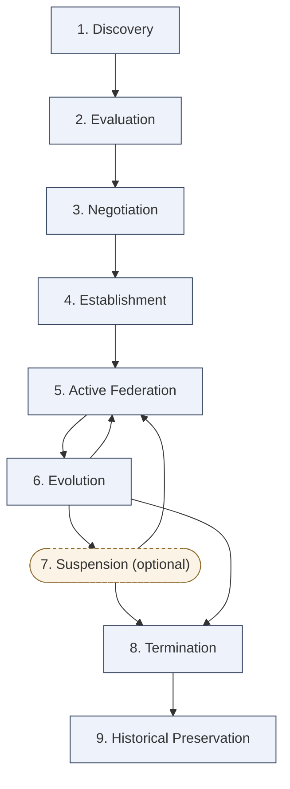

# Federation Lifecycle

*Caption: The 9-stage federation lifecycle — Discovery through Historical Preservation, with Evolution looping back to Active Federation and Suspension as an optional return path.*
