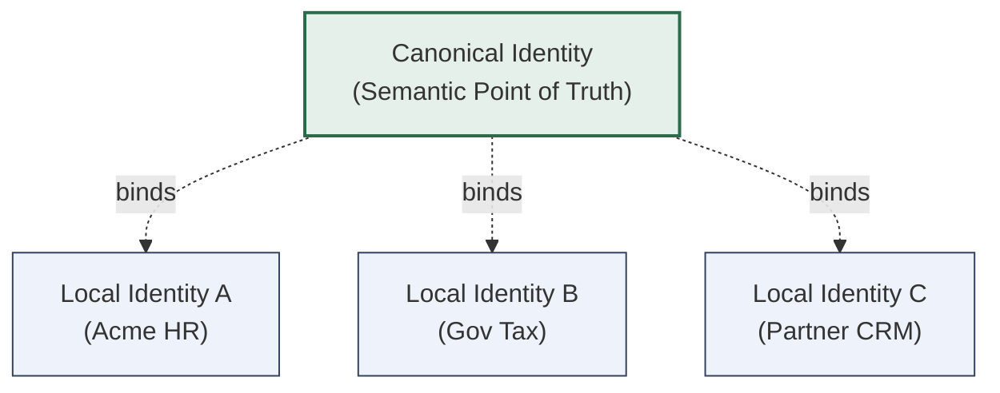

# Identity Binding

```mermaid
flowchart TD
    CAN["Canonical Identity<br/>(Semantic Point of Truth)"]

    CAN -. binds .-> LA["Local Identity A<br/>(Acme HR)"]
    CAN -. binds .-> LB["Local Identity B<br/>(Gov Tax)"]
    CAN -. binds .-> LC["Local Identity C<br/>(Partner CRM)"]

    classDef canon fill:#e6f0ea,stroke:#2b6a4a,stroke-width:2px;
    classDef local fill:#eef3fb,stroke:#33415c,stroke-width:1px;
    class CAN canon;
    class LA,LB,LC local;
```

*Caption: A single Canonical identity is bound to multiple Local identities across sovereign systems; each binding preserves the semantic authority of both sides.*
