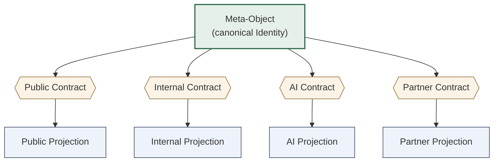

# Projection Model

```mermaid
flowchart TD
    OBJ["Meta-Object<br/>(canonical Identity)"]

    OBJ --> CP{{"Public Contract"}}
    OBJ --> CI{{"Internal Contract"}}
    OBJ --> CA{{"AI Contract"}}
    OBJ --> CX{{"Partner Contract"}}

    CP --> PP["Public Projection"]
    CI --> PI["Internal Projection"]
    CA --> PA["AI Projection"]
    CX --> PX["Partner Projection"]

    classDef obj fill:#e6f0ea,stroke:#2b6a4a,stroke-width:2px;
    classDef proj fill:#eef3fb,stroke:#33415c,stroke-width:1px;
    classDef contract fill:#fbf3e6,stroke:#8c6a2b,stroke-width:1px;
    class OBJ obj;
    class PP,PI,PA,PX proj;
    class CP,CI,CA,CX contract;
```

*Caption: One Meta-Object projects into many context-specific Projections, each governed by a Contract; every Projection references the same canonical Identity.*
