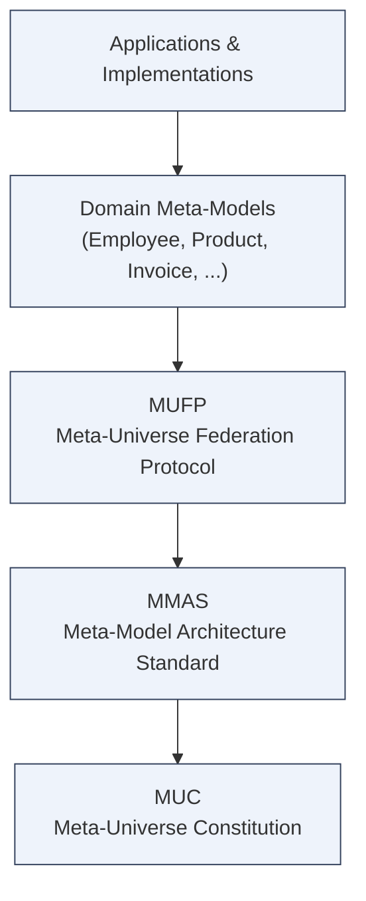

# Meta-Universe Stack

```mermaid
flowchart TD
    APP["Applications & Implementations"]
    DOM["Domain Meta-Models<br/>(Employee, Product, Invoice, ...)"]
    MUFP["MUFP<br/>Meta-Universe Federation Protocol"]
    MMAS["MMAS<br/>Meta-Model Architecture Standard"]
    MUC["MUC<br/>Meta-Universe Constitution"]

    APP --> DOM
    DOM --> MUFP
    MUFP --> MMAS
    MMAS --> MUC

    classDef layer fill:#eef3fb,stroke:#33415c,stroke-width:1px;
    class APP,DOM,MUFP,MMAS,MUC layer;
```

*Caption: The Meta-Universe stack — every layer depends only on the layers beneath it, with the Constitution (MUC) as the foundation and Applications at the top.*
